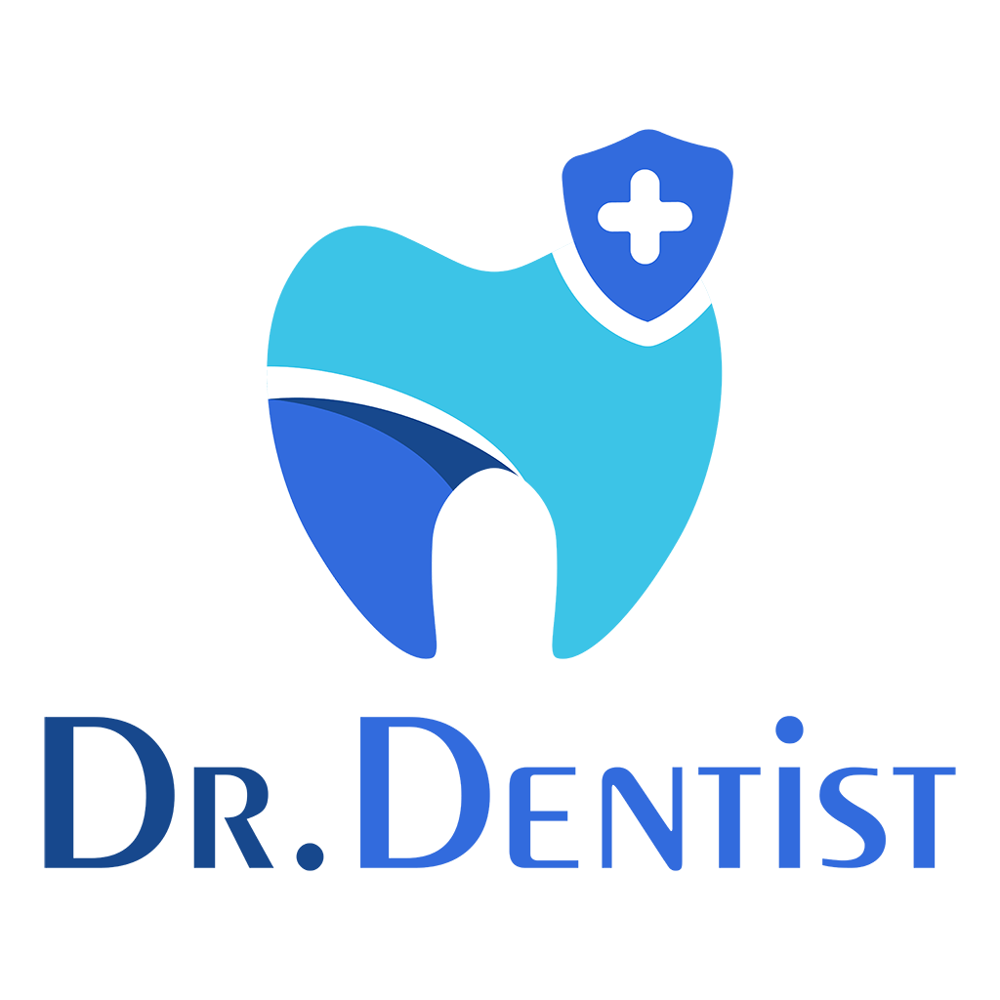
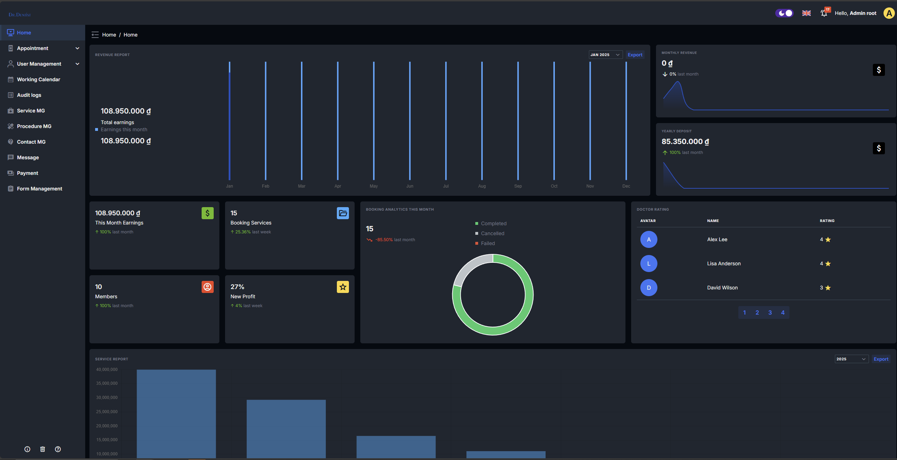

# 🦷 DrDentist - Dental Clinic Management System

<p align="center">
  <a href="https://drdentist.site" target="_blank">
    
  </a>
</p>

<p align="center">
  <a href="https://vuejs.org/"></a>
  <a href="https://www.typescriptlang.org/"></a>
  <a href="https://tailwindcss.com/"></a>
  <a href="https://capacitorjs.com/"></a>
  <a href="https://vitejs.dev/"></a>
</p>

<p align="center">
  <b><a href="https://drdentist.site">Live Demo</a></b> •
  <b><a href="#features">Features</a></b> •
  <b><a href="#getting-started">Getting Started</a></b> •
  <b><a href="#mobile-app">Mobile App</a></b> •
  <b><a href="#testing-accounts">Testing Accounts</a></b>
</p>

---

## 📋 Overview

DrDentist is a comprehensive web and mobile application for dental clinic management. Built with Vue.js 3 and TypeScript, this modern frontend interfaces with our [.NET 7 API backend](https://github.com/phamquangvinhfpt/dr-dentist-api) to provide a complete solution for dental clinics.

<p align="center">
  <a href="#" target="_blank">
    
  </a>
</p>

## ✨ Features

- 💼 **Dashboard** - Overview of clinic operations, statistics, and performance
- 📅 **Appointment Management** - Schedule, reschedule, and track appointments
- 👥 **Patient Management** - Patient profiles, history, and medical records
- 🩺 **Examination Tools** - Digital tools for dental examinations and diagnoses
- 📝 **Treatment Planning** - Create and manage treatment plans
- 💰 **Payment Processing** - Handle payments and invoicing
- 📊 **Reports & Analytics** - Generate insights from clinic data
- 📱 **Mobile Experience** - Access via Android mobile app using Capacitor
- 🌙 **Dark/Light Themes** - Customizable UI appearance
- 🌐 **Internationalization** - Support for multiple languages
- 🔔 **Real-time Notifications** - Using SignalR for instant updates

## 🚀 Getting Started

### Prerequisites

- [Node.js](https://nodejs.org/) (v16 or newer)
- [npm](https://www.npmjs.com/) or [yarn](https://yarnpkg.com/)
- [Git](https://git-scm.com/)

### Installation

1. **Clone the repository**

```bash
git clone https://github.com/phamquangvinhfpt/dr-dentist-vuestic.git
cd dr-dentist-vuestic
```

2. **Install dependencies**

```bash
npm install
# or
yarn install
```

3. **Configure environment variables**

```bash
cp .env.example .env
```

Edit the `.env` file to match your backend API configuration.

4. **Start the development server**

```bash
npm run dev
# or
yarn dev
```

The application will be available at `http://localhost:5173` (or another port if 5173 is in use).

### Building for Production

```bash
npm run build
# or
yarn build
```

The build output will be in the `dist` directory.

## 📱 Mobile App

This project supports Android mobile deployment using Capacitor.

### Building the Mobile App

1. **Build the project first**

```bash
npm run build
# or
yarn build
```

2. **Sync assets with Capacitor**

```bash
npx cap sync
```

3. **Open in Android Studio**

```bash
npx cap open android
```

4. **Build and run from Android Studio**

Use Android Studio's build and run features to deploy to a device or emulator.

## 🧪 Testing Accounts

All test accounts share the same password: `123Pa$$word!`

| Role | Email | Description |
|------|-------|-------------|
| Admin | admin@root.com | Full system access |
| Staff | staff@root.com | Clinic management access |
| Doctor | dentist@root.com | Medical staff access |
| Patient | patient@root.com | Patient portal access |
| Test Patients | patient1-4@root.com | Additional test patient accounts |

## 🛠️ Technology Stack

- **Frontend Framework**: Vue.js 3.5 with Composition API
- **State Management**: Pinia
- **Styling**: Tailwind CSS and Vuestic UI components
- **API Communication**: Axios
- **Routing**: Vue Router
- **Real-time Features**: SignalR
- **Form Validation**: Vue Composition API
- **Internationalization**: Vue i18n
- **Mobile Support**: Capacitor
- **Build Tool**: Vite

## 🤝 Contributing

Contributions are welcome! Please feel free to submit a Pull Request.

1. Fork the repository
2. Create your feature branch (`git checkout -b feature/amazing-feature`)
3. Commit your changes (`git commit -m 'Add some amazing feature'`)
4. Push to the branch (`git push origin feature/amazing-feature`)
5. Open a Pull Request

## 📄 License

This project is licensed under the MIT License - see the [LICENSE](LICENSE) file for details.

## 👥 Team

Developed by the DrDentist Team. For support or inquiries, please open an issue on the GitHub repository.

---

<p align="center">
  Made with ❤️ by DrDentist Team
</p>
